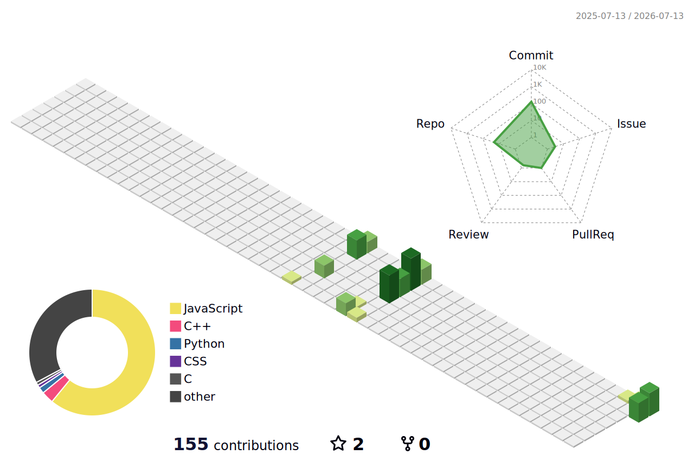

# 📊 Metrics

For the sake of the goal, if things go wrong, it simply means starting over. Thanks for visiting my profile.

<table style="border-collapse: collapse; border-spacing: 0; width: 100%;" cellspacing="0" cellpadding="0">
  <tr>
    <!-- บังคับให้ทั้งสองคอลัมน์มีขนาด 50% เท่ากันตั้งแต่เริ่มต้น -->
    <th align="center" width="50%">For user accounts</th>
    <th align="center" width="50%">CISCO Academy badge</th>
  </tr>

  <tr>
    <td align="center" style="padding: 0;">
      </img>
    </td>
    <td style="padding: 0;" align="center">
      </img>
    </td>
  </tr>
  
  <tr>
    <th colspan="2" align="center">
      <h3>🧩 MY INFORMATION METRICS OVERVIEW !</h3>
    </th>
  </tr>
  
  <tr>
    <th align="center">📅 3D PROFILE CONTRIB</th>
    <th align="center">🈷️ Language Activity</th>
  </tr>
  
  <tr>
    <td align="center" style="padding: 0;" valign="top">
      
    </td>
    <td align="center" style="padding: 0;" valign="top">
      
    </td>
  </tr>
  
  <tr>
    <th align="center">🧰 Tech Stack & Tool</th>
    <th align="center">📈 Profile Visitors</th> <!-- เปลี่ยนเป็นตัวนับคนดู หรือใส่หัวข้ออื่นตามใจชอบได้ครับ -->
  </tr>
  
  <tr>
    <!-- คอลัมน์ซ้าย: จัดการไอคอนให้ตัดขึ้นบรรทัดใหม่ด้วย &perline=8 (แถวละ 8 ไอคอน) เพื่อไม่ให้ดันคอลัมน์เพื่อน -->
    <td align="center" valign="middle" style="padding: 10px;">
      
    </td>
    <!-- คอลัมน์ขวา: ใส่เพื่อบาลานซ์ตารางให้เท่ากัน (ในตัวอย่างนี้ใส่ตัวนับผู้เข้าชมไว้ให้ ถ้าไม่ชอบสามารถเปลี่ยนเป็นรูปอื่นได้ครับ) -->
    <td align="center" valign="middle" style="padding: 10px;">
      
    </td>
  </tr>
</table>